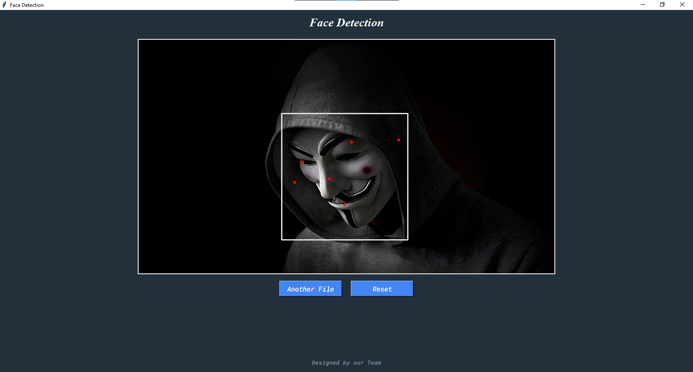

# Face Detection

This is a Face Detection application built using Python, Tkinter, OpenCV, and MediaPipe. The application allows users to take photos, stream video from a webcam, and upload image or video files to detect faces in real-time.

## Features

- **Take Photo**: Capture a photo using the webcam and detect faces in the captured image.
- **Stream Video**: Stream video from the webcam and detect faces in real-time.
- **Upload File**: Upload an image or video file to detect faces.

## Requirements

- Python 3.12.2
- opencv-python==4.10.0.84
- mediapipe==0.10.20
- pillow==11.0.0
- numpy==1.26.4

## Installation

1. Clone the repository:
    ```bash
    git clone https://github.com/kumarmalla/FaceDetection.git
    cd FaceDetectionApp
    ```

2. Install the required packages:
    ```bash
    pip install -r requirements.txt -y
    ```

## Usage

1. Navigate to the project directory:
    ```bash
    cd FaceDetection
    ```

2. Run the application:
    ```bash
    python app.py
    ```

3. Use the buttons on the interface to take a photo, stream video, or upload a file for face detection.

## Screenshots




## Acknowledgements

- [OpenCV](https://opencv.org/)
- [MediaPipe](https://mediapipe.dev/)
- [Pillow](https://python-pillow.org/)
- [NumPy](https://numpy.org/)